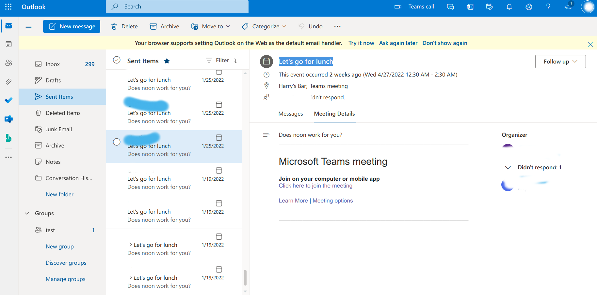
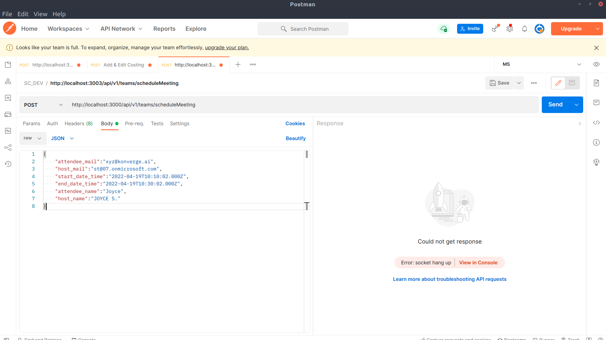

# Microsoft-Graph-API-Schedule-Meetings
Schedule Meeting feature using MS Graph APIs. 

When you got a situation like you want to build APIs using microsoft graph APIs to create events on a calender and also send a meeting link via email to meet via MS Teams, below are the steps to API setup codebase. First thing, you have to generate an auth-token by providing proper Azure Active Directory(AAD) credentials. Then you will need to pass the token through apis to authenticate and complete the given task. Below is the image of mail sent by host to attendee with meeting details,date and time.

Steps to setup API codebase

1. create a .env file and provide all the environment variables to connect to database and generate auth-token as well.
2. create mysql databases by the name of your choice and decide your data structure. You can manipulate raw queries there as per your requirement.
5. start the api on local by running  "npm run dev"
6.below screenshot guides to create an api request.

